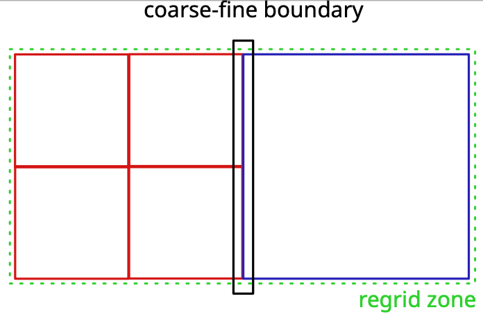
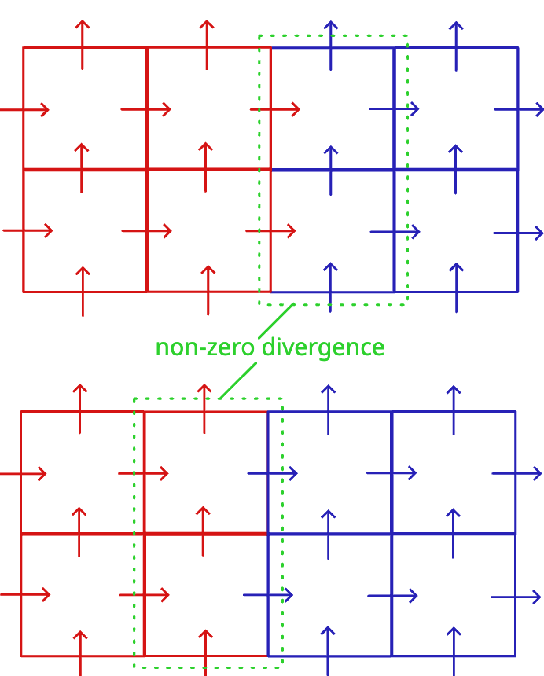
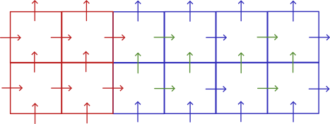

# Adaptive Mesh Refinement

## Patch based approach

## Recursive time integration

## regridding 

regridding is the process of changing the geometry of an existing mesh level in the
AMR hierarchy, by changing the number and geometry of some patches of that level.
This typically occurs when the needs for refinement evolve with the solution over time.

Concretely, regridding means removing an entire level from the AMR hierarchy and replacing
it by a new one. The so-called "new" level will be initialized by copying values
from the old level wherever they overlap, and by refining values from coarser levels
where they do not.

Technically, regridding involves different methods depending on whether particle data
is refined, or field data is. The specific operation performed also depends on the type
of field being refined, for instance the magnetic field refinement must preserve
the divergence-free character of the field.

## Field refinement

### divergence-free magnetic refinement

Refining the magnetic field consists in setting values on a given level based
on values defined on a coarse level.
This operation is necessary at several steps of the AMR simulation:

- when a new level is created, the magnetic field must be initialized
- when a level is regrided

Refining the magnetic field so to preserve its divergence-free character is
easy in general but becomes tricky when done at the coarse-fine boundaries 
during regridding.

The main difficulty lies in the fact that coarse and fine meshes share the cell
faces at the coarse-fine boundaries. We cannot have one mesh imposing its face value
blindly to the other without risking to break the divergence-free condition.

The figure above shows the region where the fine mesh ends, called the coarse-fine boundary.
The green area is one that will be regrided, here the former (red) fine mesh 
extends to the right onto the formerly coarse region. This is illustrated
in the figure below.

The figure above shows the same region after regridding is done.
In the upper part, the values of the fine faces lying at the former coarse-fine boundary
are imposed (copied) onto the new grid. The new blue components, however, did not
exist before and are obtained from refinement of coarse values only.
On the bottom part, the values of the fine mesh lying at the former coarse-fine boundary
are overwritten by values obtained from refinement of coarse values only.
Clearly, both cases break the conservation of magnetic flux.
In the first case, if the refinement of the new blue components only consider values
from the coarse mesh, it cannot account for the fine flux imposed at the former 
coarse-fine boundary and the divergence of the magnetic has thus no reason to be zero
on the cell just outside that former boundary.
In the second case, the overwritting of fine faces at the former coarse-fine boundary
will create a non-zero divergence in cells just left to the former boundary since 
one of the four faces of these cells see its flux changed.

The only way to preserve a zero divergence of the magnetic field at the coarse fine boundary
is to ensure that newly refined faces account for the flux at fine fluxes at the coarse-fine boundary.

Toth and Roe, 2002 (see [Toth and Roe formulas](toth2002)) have introduced 
a way to solve this problem, with a refinement operator able to maintain the fine cell 
divergence strictly equal to the coarse cell divergence.
This idea lies in the degree of freedom that exists in how to interpolate fine faces
that are not shared with coarse faces.
The method consists in:

- keeping fine face values at the former coarse-fine boundary
- interpolate new fine faces shared with coarse faces
- calculate the inner fine cells using interpolations between shared fine faces.

This is  illustrated in the figure below where inner new faces are represented in green.

:::{seealso}
Toth and Roe 2002
Divergence- and Curl-Preserving Prolongation and Restriction Formulas
Volume 180, Issue 2, 10 August 2002, Pages 736-750
[https://doi.org/10.1006/jcph.2002.7120](https://doi.org/10.1006/jcph.2002.7120)
:::

### Electric field refinement

Explain electric field refinement here...

## Field coarsening

Coarsening, also sometimes called "restriction" is the process of projecting the 
solution existing on a given level onto the region it overlaps on the next coarser level.
Coarsening is used so that the solution on the coarse level "feels" the fine solution
in the overlaped region, that is assumed of better quality.

### Hybrid to Hybrid coarsening

When coarsening data between two hybrid PIC levels, PHAR three types of fields:

- the electric field
- the ion total density and bulk velocity

### Hybrid to MHD coarsening

TBD

### MHD to MHD coarsening

### Electric field coarsening

### Density and bulk velocity coarsening

## Particle refinement

## Fields at level boundaries

## Particle at level boundaries

