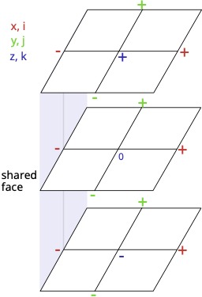

# Toth and Roe refinement

\begin{align}
u^{0,j,k}&=\frac{1}{2}(u^{+,j,k} + u^{-,j,k}) + U_{x x} + k(\Delta z)^2 V_{xyz} + j(\Delta y)^2 W_{xyz} \\
v^{i,0,k}&=\frac{1}{2}(v^{i,+,k} + v^{i,-,k}) + V_{y y} + i(\Delta x)^2 W_{xyz} + k(\Delta z)^2 U_{xyz}\\
w^{i,j,0}&=\frac{1}{2}(v^{i,j,+} + w^{i,j,-}) + W_{z z} + j(\Delta y)^2 U_{xyz} + i(\Delta x)^2 V_{xyz}
\end{align}

with:

\begin{align}
U_{x x} &= \frac{1}{8} \sum_{ijk=\pm } ijv^{i,j,k} + ikw^{i,j,k}\\
V_{y y} &= \frac{1}{8} \sum_{ijk=\pm } iju^{i,j,k} + jkw^{i,j,k}\\
W_{z z} &= \frac{1}{8} \sum_{ijk=\pm } iku^{i,j,k} + jkv^{i,j,k}\\
\end{align}

and:

\begin{align}
U_{xyz}&=\frac{1}{8}\sum_{ijk=\pm} \frac{ijku^{i,j,k}}{(\Delta y)^2+(\Delta z)^2} \\
V_{xyz}&=\frac{1}{8}\sum_{ijk=\pm} \frac{ijkv^{i,j,k}}{(\Delta x)^2+(\Delta z)^2} \\
W_{xyz}&=\frac{1}{8}\sum_{ijk=\pm} \frac{ijkw^{i,j,k}}{(\Delta x)^2+(\Delta y)^2}
\end{align}

## Divergence verification

$$
bx^{0++}-bx^{-- +} + by^{-0+}-by^{- ++} + bz^{- ++} - bz^{- +0} = \frac{D}{r^{3}} ?
$$
where $r$ is the refinement ratio of the amr grid.

\begin{align}
bx^{0++}&=\frac{1}{2}(bx^{+++}+bx^{- ++})+\frac{1}{8}(by^{+++}+bz^{+++}-by^{-++}-bz^{-++}-by^{+-+}+bz^{+-+}+by^{++-}-bz^{++-}\\
&-by^{+--}-bz^{+--}-by^{-+-}+bz^{-+-}+by^{--+}-bz^{--+}+by^{---}+bz^{---}) \\
&+\frac{1}{8} \frac{ \Delta z^2}{(\Delta x)^2 + (\Delta z)^2}(by^{+++}-by^{- ++} - by^{+ - +} - by^{++ -}  \\
&+ by^{+ --} + by^{- + -} + by^{-- +} - by^{---})  \\
&+ \frac{1}{8} \frac{\Delta y^2}{\Delta x^2 + \Delta y^2}(bz^{+++}-bz^{- ++} - bz^{+ - +} - bz^{++ -}  \\
&+ bz^{+ --} + bz^{- + -} + bz^{-- +} - bz^{---}) \\
by^{-0+}&=\frac{1}{2}(by^{-++}+by^{- -+})+\frac{1}{8}(bx^{+++}+bz^{+++}-bx^{-++}+bz^{-++}-bx^{+-+}-bz^{+-+}+bx^{++-}-bz^{++-}\\
&-bx^{+--}+bz^{+--}-bx^{-+-}-bz^{-+-}+bx^{--+}-bz^{--+}+bx^{---}+bz^{---}) \\
&-\frac{1}{8} \frac{ \Delta x^2}{(\Delta x)^2 + (\Delta y)^2}(bz^{+++}-bz^{- ++} - bz^{+ - +} - bz^{++ -}  \\
&+ bz^{+ --} + bz^{- + -} + bz^{-- +} - bz^{---})  \\
&+ \frac{1}{8} \frac{\Delta z^2}{\Delta y^2 + \Delta z^2}(bx^{+++}-bx^{- ++} - bx^{+ - +} - bx^{++ -}  \\
&+ bx^{+ --} + bx^{- + -} + bx^{-- +} - bx^{---})\\
bz^{- +0}&=\frac{1}{2}(bz^{-++}+bz^{- +-})+\frac{1}{8}(bx^{+++}+by^{+++}-bx^{-++}+by^{-++}+bx^{+-+}-by^{+-+}-bx^{++-}-by^{++-}\\
&-bx^{+--}+by^{+--}+bx^{-+-}-by^{-+-}-bx^{--+}-by^{--+}+bx^{---}+by^{---}) \\
&+\frac{1}{8} \frac{ \Delta y^2}{(\Delta y)^2 + (\Delta z)^2}(bx^{+++}-bx^{- ++} - bx^{+ - +} - bx^{++ -}  \\
&+ bx^{+ --} + bx^{- + -} + bx^{-- +} - bx^{---})  \\
&- \frac{1}{8} \frac{\Delta x^2}{\Delta x^2 + \Delta z^2}(by^{+++}-by^{- ++} - by^{+ - +} - by^{++ -}  \\
&+ by^{+ --} + by^{- + -} + by^{-- +} - by^{---})
\end{align}

differences:

\begin{align}
bx^{0++}-bx^{- ++}&=\frac{1}{2}(bx^{+++}-bx^{- ++})+\frac{1}{8}(by^{+++}+bz^{+++}-by^{-++}-bz^{-++}-by^{+-+}+bz^{+-+}+by^{++-}-bz^{++-}\\
&-by^{+--}-bz^{+--}-by^{-+-}+bz^{-+-}+by^{--+}-bz^{--+}+by^{---}+bz^{---}) \\
&+\frac{1}{8} \frac{ \Delta z^2}{(\Delta x)^2 + (\Delta z)^2}(by^{+++}-by^{- ++} - by^{+ - +} - by^{++ -}  \\
&+ by^{+ --} + by^{- + -} + by^{-- +} - by^{---})  \\
&+ \frac{1}{8} \frac{\Delta y^2}{\Delta x^2 + \Delta y^2}(bz^{+++}-bz^{- ++} - bz^{+ - +} - bz^{++ -}  \\
&+ bz^{+ --} + bz^{- + -} + bz^{-- +} - bz^{---}) \\
by^{- ++} - by^{-0+}&=\frac{1}{2}(by^{-++}-by^{- -+})-\frac{1}{8}(bx^{+++}+bz^{+++}-bx^{-++}+bz^{-++}-bx^{+-+}-bz^{+-+}+bx^{++-}-bz^{++-}\\
&-bx^{+--}+bz^{+--}-bx^{-+-}-bz^{-+-}+bx^{--+}-bz^{--+}+bx^{---}+bz^{---}) \\
&+\frac{1}{8} \frac{ \Delta x^2}{(\Delta x)^2 + (\Delta y)^2}(bz^{+++}-bz^{- ++} - bz^{+ - +} - bz^{++ -}  \\
&+ bz^{+ --} + bz^{- + -} + bz^{-- +} - bz^{---})  \\
&- \frac{1}{8} \frac{\Delta z^2}{\Delta y^2 + \Delta z^2}(bx^{+++}-bx^{- ++} - bx^{+ - +} - bx^{++ -}  \\
&+ bx^{+ --} + bx^{- + -} + bx^{-- +} - bx^{---})\\
bz^{- ++}-bz^{- +0}&=\frac{1}{2}(bz^{-++}-bz^{- +-})-\frac{1}{8}(bx^{+++}+by^{+++}-bx^{-++}+by^{-++}+bx^{+-+}-by^{+-+}-bx^{++-}-by^{++-}\\
&-bx^{+--}+by^{+--}+bx^{-+-}-by^{-+-}-bx^{--+}-by^{--+}+bx^{---}+by^{---}) \\
&-\frac{1}{8} \frac{ \Delta y^2}{(\Delta y)^2 + (\Delta z)^2}(bx^{+++}-bx^{- ++} - bx^{+ - +} - bx^{++ -}  \\
&+ bx^{+ --} + bx^{- + -} + bx^{-- +} - bx^{---})  \\
&+ \frac{1}{8} \frac{\Delta x^2}{\Delta x^2 + \Delta z^2}(by^{+++}-by^{- ++} - by^{+ - +} - by^{++ -}  \\
&+ by^{+ --} + by^{- + -} + by^{-- +} - by^{---})
\end{align}

multiplying by $8=r^{3}$ 

\begin{align}
&4bx^{+++}-4bx^{- ++}+by^{+++}+bz^{+++}-by^{-++}-bz^{-++}-by^{+-+}+bz^{+-+}+by^{++-}-bz^{++-} \\
&-by^{+--}-bz^{+--}-by^{-+-}+bz^{-+-}+by^{--+}-bz^{--+}+by^{---}+bz^{---} \\
&4by^{-++}-4by^{- -+}-bx^{+++}-bz^{+++}+bx^{-++}-bz^{-++}+bx^{+-+}+bz^{+-+}-bx^{++-}+bz^{++-}\\
&+bx^{+--}-bz^{+--}+bx^{-+-}+bz^{-+-}-bx^{--+}+bz^{--+}-bx^{---}-bz^{---} \\
&4bz^{-++}-4bz^{- +-}-bx^{+++}-by^{+++}+bx^{-++}-by^{-++}-bx^{+-+}+by^{+-+}+bx^{++-}+by^{++-}\\
&+bx^{+--}-by^{+--}-bx^{-+-}+by^{-+-}+bx^{--+}+by^{--+}-bx^{---}-by^{---} \\ \\ \\

&+\frac{ \Delta z^2}{(\Delta x)^2 + (\Delta z)^2}(by^{+++}-by^{- ++} - by^{+ - +} - by^{++ -}+ by^{+ --} + by^{- + -} + by^{-- +} - by^{---})  \\
&+ \frac{\Delta y^2}{\Delta x^2 + \Delta y^2}(bz^{+++}-bz^{- ++} - bz^{+ - +} - bz^{++ -} + bz^{+ --} + bz^{- + -} + bz^{-- +} - bz^{---}) \\ \\
&+ \frac{ \Delta x^2}{(\Delta x)^2 + (\Delta y)^2}(bz^{+++}-bz^{- ++} - bz^{+ - +} - bz^{++ -} + bz^{+ --} + bz^{- + -} + bz^{-- +} - bz^{---})  \\
&- \frac{\Delta z^2}{\Delta y^2 + \Delta z^2}(bx^{+++}-bx^{- ++} - bx^{+ - +} - bx^{++ -} + bx^{+ --} + bx^{- + -} + bx^{-- +} - bx^{---}) \\
&-\frac{ \Delta y^2}{(\Delta y)^2 + (\Delta z)^2}(bx^{+++}-bx^{- ++} - bx^{+ - +} - bx^{++ -} + bx^{+ --} + bx^{- + -} + bx^{-- +} - bx^{---})  \\
&+ \frac{\Delta x^2}{\Delta x^2 + \Delta z^2}(by^{+++}-by^{- ++} - by^{+ - +} - by^{++ -} + by^{+ --} + by^{- + -} + by^{-- +} - by^{---})
\end{align}

working the first and second order terms out, we get:

\begin{align}
&2(bx^{+++}+bx^{+ --} - bx^{- ++} - bx^{---}  \\
&+ by^{- ++}+by^{++ -} - by^{-- +} - by^{+ --}  \\
&+ bz^{- ++} + bz^{+ - +} - bz^{- + -} - bz^{+ --}) 
\end{align}

Now working out the third order terms. We can add them 2 by 2 to have the fraction in the front simplify to 1 or -1. We get:

\begin{align}
&by^{+++} - by^{- ++} - by^{+ - +} - by^{++ -} + by^{+ --} + by^{- + -} + by^{-- +} - by^{---} \\
+&bz^{+++} - bz^{- ++} - bz^{+ - +} - bz^{++ -} + bz^{+ --} + bz^{- + -} + bz^{-- +} - bz^{---} \\
-&bx^{+++} + bx^{- ++} + bx^{+ - +} + bx^{++ -} - bx^{+ --} - bx^{- + -} - bx^{-- +} + bx^{---}
\end{align}

Adding this to the previous expression:

\begin{align}
&bx^{+++}+bx^{+- +}+bx^{++-}+bx^{+ - -}-bx^{- + +}  -bx^{- + -}-bx^{-- +} -bx^{- --}\\
+&by^{+++}+by^{- + +}+by^{++ -}+by^{-+-}-by^{+ - +}-by^{- - +} -by^{+ --} -by^{-- -} \\
+&bz^{+++}+bz^{- + +}+bz^{+- +}+bz^{--+}-bz^{+ + -}-bz^{- + -} -bz^{+ --} -bz^{-- -}
\end{align}

Rearranging and redividing by $8=r^{3}$:
$$
\frac{1}{r^{3}} (Bx^{+}-Bx^{-}+By^{+}-By^{-}+Bz^{+}-Bz^{-})=\frac{D}{r^{3}}
$$
